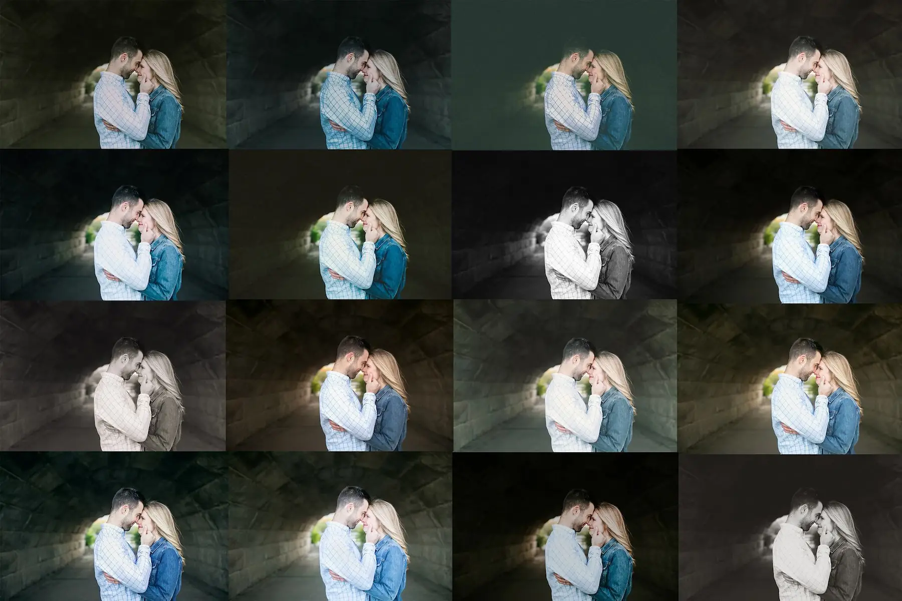
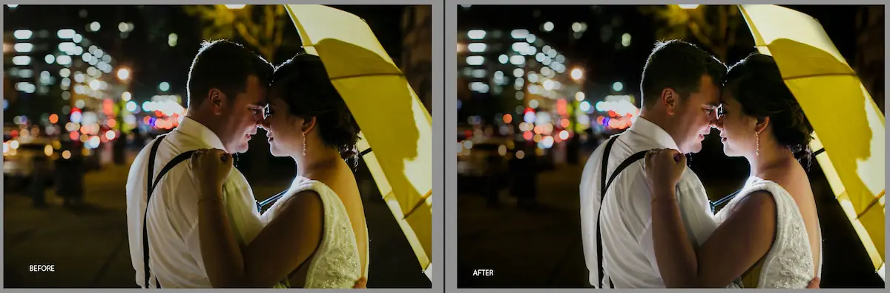

{% include hero.html
  image="/images/bespoke-tone-edits-46.webp"
  image_small="/images/bespoke-tone-favorites-0020.webp"
  alt="flower clutch"
  heading="Welcome"
  content="Bespoke Tone is a section of Van Elk & Co that focuses on helping photographers at all stages. We are so excited to finally put our ideas out there to educate, and even work for photographers, creating a custom experience for all. We are so thrilled to work with fellow photographers and business owners. We hope that all our hard work helps make running your business  much simpler and more enjoyable."
  subheading="Jenn & Steve"
%}

<section id="about" class="section card-section">
  

    

      
    

    

      <h2>Why Bespoke?</h2>
    

  

  

    From day one of starting our business from scratch, we've spent countless hours educating ourselves and talking to other business owners, hoping to create a successful business. What we realized was that because every business is unique, every business needs a customized approach. There's no single service plan that can help every business.
  

  

    Once our business was established, we started receiving inquiries from other owners asking, "how?" As we received more requests, we started to become passionate about helping other owners and strived to make their experience a bit easier than ours was at the beginning.
  

</section>

<section id="mentoring" class="section mentoring-section">
  <h2>Mentoring</h2>
  

    

      

        We find so much joy in seeing others succeed, that we want to educate other business owners as they start their companies.
        Mentoring sessions are catered to your needs, to help create a more successful year for your business.
        Whether you are starting your business or have just hit a wall, you'd be surprised by what having an outside perspective can do.
        We know from experience. I hope that our business successes and mistakes can help your business succeed even quicker.
      

    

    

      <h3>Some of the topics we can discuss:</h3>
        
 Pricing, Customer Service, Time Management, Goals, Photography Skills, Marketing, Social Media Presence, Emails, Inquiries, Motivation, & Business Management
        

      <h3>Rates</h3>
      
<strong>Video chat:</strong> $99 an hour

      
<strong>In home sessions:</strong> $350 for 3–4 hours (great for new businesses)

      
<em>Mentoring isn't limited to photographers.</em>

    

  

</section>

<section id="editing" class="section">
  <h2>Editing Services</h2>
  
  
We've set ourselves apart from the competition by making your experience customizable. Just as if we were a business partner, we know your style and would create a finished product as if you were doing it yourself. From basic exposure corrections to custom presets, we want to hand over fully finished galleries that can be uploaded and sent to your couple days after the shoot. We set exposure, color correct, apply a preset of your choosing, crop, and even choose 50+ images to duplicate to black and white. Your galleries reflect your style and you'll have more time to focus on the things you love.
  

  
Custom Wedding Editing Services at $175 
    Custom Session Editing Services at $50 
    Culling Service at $.04 an image
  

  
If interested, please contact so we can establish your editing style profile & edit your beautiful work very soon!
  

</section>

<section id="reviews" class="section card-section">
  <h2>What People Say</h2>

  

    

      

        <h4>Brittany's Review</h4>
        

            I can't say enough great things about Jenn & Steven! They are an amazing editing duo. They well exceeded my expectations last year with editing several weddings for my studio. They took the time to get the edits just perfect & made me feel like all their attention was on me and my work. As a professional photographer it's hard to find a good balance between the photo world and life. Taking wedding edits out of the equation opened up so much time, time that was then well spent snuggling with my lil one instead of the computer screen! Highly recommend!
        

      

    

  

  

    

      

        <h4>Brooke's Review</h4>
        

            Jenn has the traits of a natural born mentor -- she has an innate ability to nurture, support, and encourage; a characteristic which allows those around her to immediately feel comfortable and at ease. When you combine that with her diverse, well-rounded photography background, you have the ideal coach -- imparting her knowledge and cheering for your ultimate success and growth.
        

      

    

  

</section>